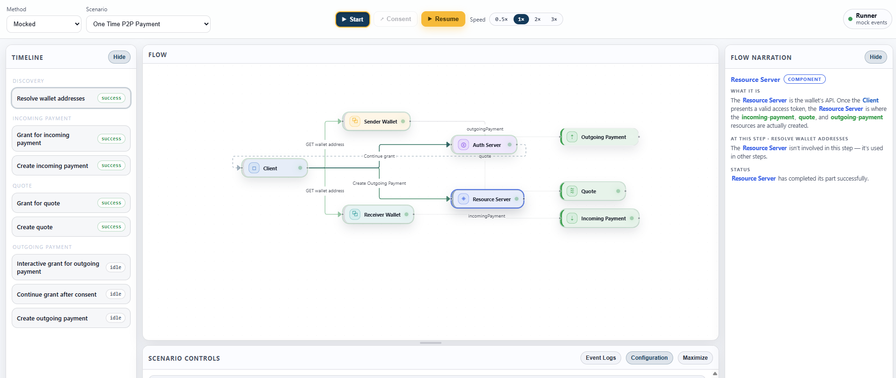

# OpenPayments Viz

An interactive, educational visualizer for [Open Payments](https://openpayments.dev) flows.
Watch a payment move through wallet-address discovery, **GNAP** grants, quotes, interactive
consent, and the final outgoing payment, step by step, with a live graph, a timeline, and
plain-language narration of what each component does.



You can explore it two ways:

- **Mocked**: a scripted run with no setup. Best for first exposure to the concepts.
- **Interledger TestNet**: a real run against the Interledger test network, driving the
  actual Open Payments API end-to-end (including the human consent redirect).

## Repository layout (npm workspaces)

- `packages/shared`: the flow DSL, scenario definitions, and the event schema shared by the
  runner and the web app.
- `apps/runner`: a local Node service (Express + SSE). It executes the Open Payments flow
  against TestNet and streams structured events to the UI. It reads your private key from disk
  and **never sends it to the browser**.
- `apps/web`: the React + Vite visualizer (graph, timeline, narration, event log).

## Prerequisites

- **Node.js 20+** and npm.
- For TestNet runs only: an Interledger test-wallet account, two wallet addresses, and a
  key pair (see [TestNet setup](#testnet-setup)).

## Install

From the repo root:

```bash
npm install
```

## Run

| Command | What it starts | Use for |
| --- | --- | --- |
| `npm run dev` / `npm run dev:web` | Web UI only, with hot reload (`http://localhost:5173`) | **Mocked** mode, development |
| `npm run dev:runner` | Runner only (`http://localhost:3344`) | — |
| `npm run dev:all` | **Both** runner + web (dev) | **TestNet** mode, development |
| `npm run serve` | Builds, then runs **both** optimized | Running locally (see below) |
| `npm start` | Runs **both** optimized (assumes you've built) | Re-running after a build |

### Running the optimized build locally

```bash
npm run serve
```

This builds the production web bundle and then starts both processes:

- **Runner** on `http://localhost:3344` (run with `tsx`).
- **Web UI** (the optimized Vite build, served by `vite preview`) on `http://localhost:5173`, the same port as dev, so the runner's CORS and consent-redirect defaults work unchanged.

Open `http://localhost:5173`. Use `npm start` on subsequent runs to skip the rebuild. Stop both
with `Ctrl+C`.

### Mocked mode (no setup)

1. `npm run dev`
2. Open `http://localhost:5173`.
3. Leave **Method** on *Mocked*, pick a **Scenario**, press **Start**.
4. When the run pauses for consent, press **Consent** to simulate approval; the run finishes
   automatically. Use the **Speed** presets to slow down or speed up playback.

The timeline, graph, and narration follow the run automatically. Click any step, node, or
arrow at any time to pin the explanation panel to it.

On first load a short **welcome guide** explains the basics and suggests a scenario order; reopen
it anytime with the **?** button in the header. The **Legend** button (top-right of the Flow
panel) decodes the graph's symbols, colours, and arrow styles.

### TestNet mode (real run)

1. Complete the [TestNet setup](#testnet-setup) below.
2. `npm run dev:all`
3. Open `http://localhost:5173` and switch **Method** to *Interledger TestNet*.
4. Open the **Configuration** tab and fill in:
   - **Key ID** and **Private key path** (an absolute path on the machine running the runner).
   - **Client / Sending / Receiving** wallet addresses (payment pointers starting with `$`
     are accepted and normalized to `https://`).
5. Press **Start**. When the flow reaches the interactive outgoing-payment grant, press
   **Consent**, approve in the tab that opens, and you'll be redirected back; the runner
   continues the grant and creates the payment automatically.

> **A note on currencies.** This tool was designed with the **sender on a USD wallet** and the
> **receiver on a EUR wallet** (so the scenarios can show currency conversion). You may use wallet
> addresses in any currencies, but if they differ from USD → EUR the help text and example figures
> (e.g. the P2P "≈€8.58" or the subscription "≈$17.48") will not match your actual run.

## TestNet setup

1. Create an account in the **Interledger Test Wallet**
   (<https://wallet.interledger-test.dev>) and create one or more **wallet addresses**. For a
   peer-to-peer payment you need a sending and a receiving wallet address; the client wallet
   address can be the sending one.
2. Generate a **key pair** for your account. You'll get a **Key ID** and a **private key
   file** (e.g. `private.key`). Keep the private key on the machine that runs the runner.
3. The single-script reference this UI mirrors is [`example.js`](example.js), useful if you
   want to see the same flow run headless in a terminal.

> Wallet addresses, asset codes, and balances on TestNet carry no real money.

## How consent works (interactive grant)

Spending money requires the wallet owner's approval, so the outgoing-payment grant is
**interactive**:

1. The runner requests the grant and receives a redirect URL (no token yet), emitted as a
   `grant.interactive_required` event.
2. Pressing **Consent** opens that URL; you approve at the auth server.
3. The auth server redirects to the runner's local callback (`http://localhost:<callbackPort>/callback`),
   which captures the `interact_ref` and then redirects your browser back to the UI.
4. The runner continues the grant and creates the outgoing payment.

Secrets (`interact_ref`, access tokens) are **never** placed in the URL sent back to the UI.

## Configuration & environment

Runner (`apps/runner`):

- `PORT`: runner port (default `3344`).
- `RUNNER_CORS_ORIGINS`: comma-separated allowed origins (default
  `http://localhost:5173,http://127.0.0.1:5173`).
- `RUNNER_UI_URL`: UI base URL for the post-consent redirect (default `http://localhost:5173/`).
- `CONSENT_TIMEOUT_MS`: how long to wait for consent before failing the run (default
  `180000` = 3 min).

## Troubleshooting

- **"Consent timed out"**: you didn't complete the consent redirect within `CONSENT_TIMEOUT_MS`.
  Press Start again, then Consent, and approve promptly (raise `CONSENT_TIMEOUT_MS` if needed).
- **"Callback port … is already in use"**: a previous callback server (default port `3999`) is
  still bound. Stop any leftover runner process and start the run again to free it.
- **Grant continuation error**: the consent wasn't completed, expired, or was already used.
  Start the run again.
- **The failing step turns red** in the timeline and graph; open the **Event Logs** tab for the
  full error payload.
- **Private key not found**: use an *absolute* path to the `.key` file on the runner machine.

## Security notes

- Private keys are read from disk by the runner and kept in memory only; they are never sent to
  the browser or written back to disk.
- `.key`, `*_ID.txt`, and `*.pem` files are git-ignored; it is safe to keep your credentials in the
  project directory.
